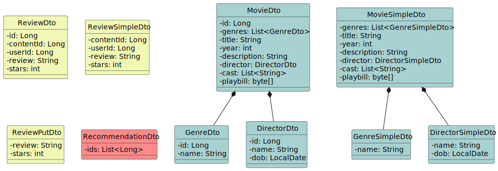

# Movies Recommender Catalogue

This repository contains the implementation of semestral team project under the course PA165 at FI MUNI.

## Assignment

The web application is a catalogue of movies of different genres. Each movie has a title, description, film director, and list of actors, and image(s) from the main playbill. Each movie is categorized in one or more genres. Only the administrator can create, remove and update the list of movies. Users can rate the movies according to different criteria (e.g how novel are the ideas of the movie, their final score, etc…). The main feature of the system is that users can pick one movie and get the list of similar movies and / or movies that were liked the most by other users watching the same movie (no need of complex algorithms, some simple recommendation is enough!).

## Services

The project was designed with five services in mind.

### Gateway

Gateway serves as a proxy for the rest of the system. It contains zero business logic. It is just an entrypoint that could implement load balancing/service discovery/auth in the future.

### Content

Content is a service which handles all content related data. I.e. content management: content fetching, content creation, content edits and their deletion.

### Users

Users is a service intended to handle user related data. I.e. user management: account fetching, account creation, logins, registrations, account edits and deletes. Note that the service was not implemented as one of the team members left the course.

### Reviews

Reviews is a service which handles all review related data. I.e. review management: review fetching, review creation, review edits and their deletion.

### Recommendations

Recommendations is a service which handles all recommendations. It's sole purpose is to execute recommendation algorithm for specific content and evaluate the best possible suggestions on the data it stores.

## Showcase

We have implemented a possible showcase scenario that simulates meaningfull user interaction with the system. The scenario is implemented as a Postman collection and can be viewed on [this URL](https://www.postman.com/dungeon-software/workspace/movies-recommender/collection/24639654-cd972425-c986-450e-a944-2d9670557149?action=share&creator=24639654). Its explanation and goals are described in the collection itself.

## Architecture


## Getting started

Prerequisites:
- Docker
- Docker compose

### Running the whole project

Starting the project is as simple as running:
```
docker compose --profile all up
```

### Running a single service

If you only want to start a single service, you can. Running just reviews would like like this:
```
docker compose --profile reviews up
```

### Running tests

If you want to test a single/multiple services, you will have to start their dependencies first:
```
docker compose --profile dependencies up
```
Running the tests is as simple as running:
```
mvn test
``` 
in the specific service/project directory.

## Event Storming


## DTOs



## Team Members

- [Stanislav Zeman](https://is.muni.cz/auth/osoba/524881)
- [Martin Ragan](https://is.muni.cz/auth/osoba/524712)
- [Štefan Šidlovský](https://is.muni.cz/auth/osoba/514508)
- [~~Boris Savov~~](https://is.muni.cz/auth/osoba/524847)
